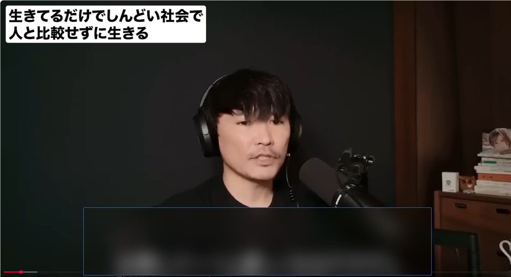
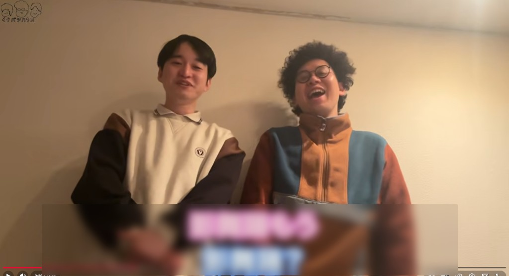

# YouTube Sub Blur

Chrome extension that blurs hard-coded subtitles on YouTube videos. Built for language immersion -- hide distracting hardsubs so you can focus on listening.





## Features

- Toggleable blur overlay with **Alt + B** (customizable)
- Drag to reposition, drag edges/corners to resize
- Box position and size saved automatically
- Scales between windowed, theater, and fullscreen
- Adjustable blur strength (1-40)
- Option to auto-show on every video
- **Review Mode** (**Alt + R**) -- rewinds and plays the segment twice: once with subs visible, once with blur on, so you can check your comprehension
- **Auto Review Mode** -- continuous mode that automatically loops through the video chunk by chunk
- **OCR Subtitle Mining** (**Alt + M**) -- extract text from hard-coded subtitles for use with Yomitan
- **Anki Integration** -- automatically attaches a video screenshot and sentence audio to your Anki cards when mining

## Hotkeys

| Hotkey | Action |
|--------|--------|
| Alt + B | Toggle blur overlay |
| Alt + R | Review Mode (one-shot rewind loop) |
| Alt + M | Mine subtitle (OCR + Anki screenshot/audio) |

Hotkeys can be changed at `chrome://extensions/shortcuts`.

## Install

### Chrome Web Store

[YouTube Sub Blur on Chrome Web Store](https://chromewebstore.google.com/detail/youtube-sub-blur/hmmnmcgcofibhdgiebicacdpihhcplgl)

### Manual

1. Download or clone this repo
2. Open `chrome://extensions/` and enable **Developer mode**
3. Click **Load unpacked** and select the project folder
4. Open any YouTube video and press **Alt + B**

## Settings

Click the extension icon to open the popup:

- **Default On** -- auto-show the blur box when a video loads
- **Auto Review Mode** -- enable continuous review loop mode
- **Blur Strength** -- how strong the blur effect is (1-40)
- **Rewind Duration** -- how far back the review loop rewinds (3-30s)
- **2-Pass Review** -- on = rewind with subs then replay blurred (default); off = rewind with subs only, then continue
- **Anki Screenshot Field** -- Anki field name for the video screenshot (default: `Picture`)
- **Anki Audio Field** -- Anki field name for sentence audio (default: `SentenceAudio`)
- **Audio Clip Duration** -- seconds of audio to capture (3-15s)

## Advanced: OCR + Anki Mining Setup

The blur box works out of the box with no extra setup. The features below are optional and add OCR subtitle extraction with automatic Anki card enrichment (screenshot + sentence audio).

### Quick setup (Windows)

Run the setup script -- it installs everything and configures auto-start:

```
setup.bat
```

Then install [AnkiConnect](https://ankiweb.net/shared/info/2055492159) in Anki: **Tools > Add-ons > Get Add-ons** and paste code `2055492159`.

### Manual setup

<details>
<summary>Click to expand</summary>

#### Requirements

- [Python 3.10+](https://www.python.org/downloads/)
- [Anki](https://apps.ankiweb.net/) with [AnkiConnect](https://ankiweb.net/shared/info/2055492159) plugin installed
- [yt-dlp](https://github.com/yt-dlp/yt-dlp) (for sentence audio)
- [ffmpeg](https://ffmpeg.org/) (for sentence audio)

#### 1. Install Python dependencies

```
pip install meikiocr owocr numpy Pillow yt-dlp
```

#### 2. Install ffmpeg

Download from [ffmpeg.org](https://ffmpeg.org/download.html) or install via winget:

```
winget install Gyan.FFmpeg
```

Make sure `ffmpeg` is available on your PATH.

#### 3. Start the OCR server

```
python ocr_server.py
```

The server runs locally at `http://localhost:7331` and handles:
- Japanese OCR using Google Lens (primary) with MeikiOCR as fallback
- Audio extraction from YouTube via yt-dlp + ffmpeg

#### 4. Auto-start on login (Windows)

Copy `start_ocr.vbs` to your Startup folder:

```
%APPDATA%\Microsoft\Windows\Start Menu\Programs\Startup
```

This starts the OCR server silently in the background when you log in.

</details>

### Configure Anki fields

Make sure your Anki note type has fields matching the extension settings:
- A field for screenshots (default: `Picture`)
- A field for sentence audio (default: `SentenceAudio`)

You can change the field names in the extension popup to match your note type.

### Mining workflow

1. Watch a YouTube video with blur on
2. Press **Alt + M** -- OCR extracts the subtitle text, video pauses
3. Hover the text with Yomitan and mine the word to Anki
4. Press **Spacebar** to resume -- the screenshot and sentence audio are automatically attached to your new card

## Privacy

No data is collected. The extension only stores your preferences locally via Chrome's storage API. The OCR server runs entirely on your machine. See [Privacy Policy](PRIVACY_POLICY.md).
